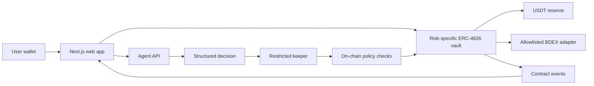

# System Architecture

## Components

### Web

Next.js renders the user experience. wagmi and viem provide wallet, chain, and
contract interactions. Chain reads are authoritative for balances and status.

### Vaults

Three ERC-4626-compatible vault instances accept the same USDT underlying. Each
instance is configured with a distinct exposure and slippage policy. A user
selects risk by selecting a vault, not by storing a per-user preference inside
a pooled vault.

### Policy and strategies

The policy layer validates keeper role, decision ID, expiry, cooldown,
allocation totals, exposure cap, slippage, and approved strategy targets. The
reserve holds liquid USDT. BDEX is isolated behind an allowlisted adapter.

### Agent and keeper

The agent produces data, never calldata. The keeper owns a limited operational
key and submits schema-valid decisions. On-chain rules remain authoritative.

### Shared package

`packages/shared` owns chain constants, public decision types, and validation
schemas used by both web and agent services. Deployed addresses belong in a
versioned deployment artifact rather than duplicated source constants.

## Source of truth

- Ownership, shares, balances, policies, and executions: BOT Chain
- Explanations and input snapshots: agent store, anchored by an on-chain hash
- Pending UI state: browser cache only

## Implementation references

Backend agents must use the following detailed specifications rather than
inferring behavior from the diagram alone:

- `AGENT_HANDOFF.md` for fixed decisions and ownership boundaries
- `BACKEND_IMPLEMENTATION.md` for delivery order and API targets
- `CONTRACT_SPEC.md` for roles, payloads, events, and invariants
- `API_CONTRACT.md` for frontend/backend status and response shapes

The current implementation target is testnet. Mainnet configuration is a
separate release gate and must not be inferred from testnet artifacts.
